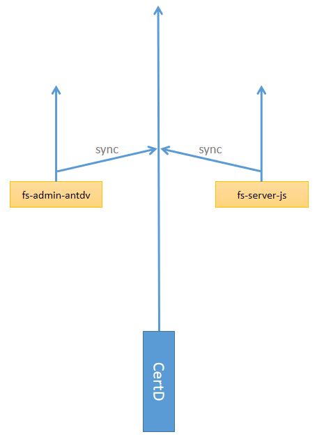
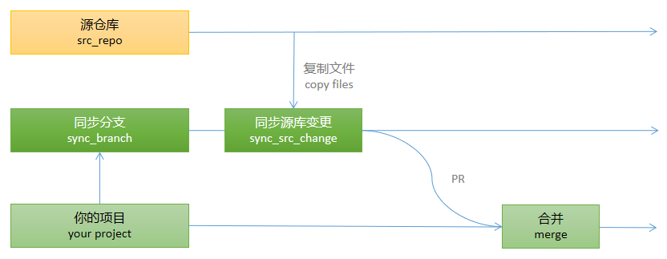
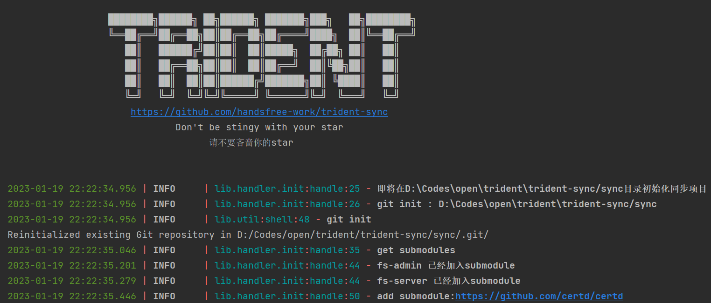

# 🔱 trident-sync 三叉戟同步

三叉戟同步，是一款异构项目同步升级工具，二次开发同步神器。

[中文](./readme.md)

## 1. 简介

当我们的项目内部使用了其他项目进行二次开发，那么这个模块就只能停留在当时的版本，无法方便的更新。

本工具可以自动获取变更并合并到你的项目仓库，让二次开发项目可以持续升级。

本工具适用于所有不能简单fork就可以二次开发的场景：

* 源项目与你项目目录结构不一致（异构）。
* 源项目本身的submodule过多，一个个fork，merge太麻烦。
* 源项目只是你项目的一个子模块，但你不想用submodule

## 2. 缘起

我有一个 [certd](https://github.com/certd/certd) 项目，这是一个自动更新ssl证书的工具，但这不是重点。     
重点是它一开始只是一个独立的命令行工具。    
目录结构如下：

```
src
| --packages
    | --core           
    | --plugins        

```

某一天我想开发v2版本，把它升级成一个带后台和界面的web项目。      
恰好我找到了两个模版项目(其实也是我写的🤭),可以帮我快速实现以上需求。

* [fs-admin-antdv](https://github.com/fast-crud/fs-admin-antdv)  （前端admin模版）
* [fs-server-js](https://github.com/fast-crud/fs-server-js)  （服务端）

我把这两个项目复制到了`certd`项目中，进行二次开发。     
此时`certd`项目目录结构变成如下：

```
src
| --packages
    | --core
    | --plugins
    | --ui
        | --certd-client   //这是fs-admin-antdv的副本
        | --certd-server   //这是fs-server-js的副本
```

为了使`certd-client`和`certd-server`能够随时同步`模版项目`的更新       
我将使用本项目`trident-sync`来自动帮我升级。

<p align="center">

<p align="center">像不像个三叉戟🔱？</p>
<p>

## 3. 原理过程

初始化（init）：

1. 初始化`同步工作仓库`（sync_work_repo）
2. `clone` `源仓库`（src_repo）和`目标仓库`（target_repo），添加到`同步工作仓库`的`submodule`
3. 给`目标仓库`创建并切换到`同步分支`（sync_branch）
4. 将`源仓库内的文件`复制到`目标仓库对应的目录`，然后`commit、push`
5. 此时`目标仓库`内的`sync_branch`分支拥有`源仓库`的副本

同步（sync）：

1. 当`源仓库`有变更时、拉取`源仓库`更新
2. 删除`目标仓库对应的目录`，复制`源仓库所有文件`到`目标仓库对应的目录`
3. 此时`git add . && git commit` 提交的就是`源仓库变更部分`
4. 至此我们成功将`源仓库的更新`转化成了`目标仓库的commit`，后续就是常规的合并操作了。
5. 创建`target.sync_branch` -> `target.main`的`PR`
6. 处理`PR`，合并到开发主分支，升级完成

<p align="center">

<p align="center">同步流程图</p>
<p>

> 没有冲突的话，同步过程可以全部自动化。    
> 解决冲突是唯一需要手动的部分。

## 4. 快速开始

### 4.1 准备工作

* 安装 [python (3.8+)](https://www.python.org/downloads/)
* 安装 `git`
* 准备你的项目和要同步的源项目

### 4.2 安装本工具

```shell
# 安装本工具，安装成功后就可以使用 trident 命令了
pip install trident-sync --upgrade
```

### 4.3 编写配置文件

* 创建一个同步工作目录，你可以任意命名，接下来都在这个目录下进行操作

```
mkdir sync_work_repo
cd sync_work_repo
```

* 编写`./sync_work_repo/sync.yaml`， 下面是示例，请根据其中注释说明改成你自己的内容

```yaml
# ./sync_work_repo/sync.yaml
repo: # 仓库列表，可以配置多个仓库
  fs-admin: # 上游项目1，可以任意命名
    url: "https://github.com/fast-crud/fs-admin-antdv" # 源仓库地址
    path: "fs-admin-antdv"            # submodule保存路径，一般配置仓库名称即可
    branch: "main"                    # 要同步过来的分支
  certd: # 你的项目（接受同步项目），可以任意命名
    url: "https://github.com/certd/certd"  # 目标仓库地址
    path: "certd"                    # submodule保存路径，一般配置仓库名称即可
    branch: "dev"                    # 你的代码开发主分支（接受合并的分支）例如dev、main、v1、v2等
    # 以下配置与PR相关，更多关于PR的文档请前往 https://github.com/handsfree-work/trident-sync/tree/main/doc/pr.md
    # 第一次使用，你可以暂时不配置，同步完之后需要手动操作合并
    token: ""                         # 仓库的token，用于提交PR
    type: github                      # 仓库类型，用于提交PR，可选项：[github/gitee/gitea]
    auto_merge: true                  # 是否自动合并,如果有冲突则需要手动处理
# 注意： 初始化之后，不要修改url和path，以免出现意外。但是可以添加新的repo.

sync: # 同步配置，可以配置多个同步任务
  client: # 同步任务1，可以任意命名
    src: # 源仓库
      repo: fs-admin                  # 源仓库名称，上面repo配置的仓库引用
      dir: '.'                        # 要同步给target的目录（不能为空目录）
    target: #接受合并的仓库，就是你的项目
      repo: certd                     # 目标仓库名称，上面repo配置的仓库引用
      dir: 'package/ui/certd-client'  # 接收src同步过来的目录
      # ↑↑↑↑↑↑↑↑↑↑↑↑↑↑↑↑↑↑↑↑↑↑↑↑↑↑↑↑    如果你之前已经使用源仓库副本做了一部分特性开发，那么这里配置源仓库副本的目录）
      branch: 'client_sync'           # 同步分支名称（需要配置一个未被占用的分支名称）

options: #其他选项
  repo_root: repo          # submodule保存根目录
  push: false              # 同步后是否push
  # ↑↑↑↑↑↑↑↑↑↑↑↑↑↑↑↑↑↑↑↑↑↑↑  第一次使用，先本地测试，不push，没问题之后再改成true
  pull_request: true       # 是否创建pull request，需要目标仓库配置token和type
  proxy_fix: true          # 是否将https代理改成http://开头，解决python开启代理时无法发出https请求的问题
  use_system_proxy: true   # 是否使用系统代理

```

### 4.4 初始化

此命令会将`sync_work_repo`目录初始化成一个git仓库，然后将`sync.yaml`中配置的`repo` 添加为`submodule`

```shell
cd sync_work_repo
# 执行初始化操作
trident init 
```

<p align="center">

<p align="center">初始化执行效果</p>
<p>

> 只需运行一次即可，除非你添加了新的`repo`    

> 初始化过程会将多个仓库添加为submodule，此步骤在网络不好时容易出问题   
> 你可以删除目录下除`sync.yaml`之外的所有文件，重新运行`trident init`命令

### 4.5 进行同步

将根据`sync.yaml`中`sync`配置的同步任务进行同步更新，并提交PR，[你需要视情况处理PR](#5-合并分支)

```shell
# 以后你只需要定时运行这个命令，即可保持同步升级
trident sync 
```

运行效果

```
root:~/sync_work_repo$ trident sync 
.
.
.
2023-01-28 14:13:41 | INFO    | - refs:[<git.Head "refs/heads/main">]
2023-01-28 14:13:41 | WARNING | - Skip push，The remote address is not set for the current repository. Use the [trident remote <repo_url>] command to set the remote address of the repository and save the synchronization progress
2023-01-28 14:13:41 | INFO    | - ----------------result:✅----------------
 🏹 task            -->  success:✅     copy:✅   change:✅   commit:✅     push:✅       pr:✅    merge:✅
 🔱 sync_work_repo  -->   change:✅   commit:✅     push:🚫 
2023-01-28 14:13:41 | INFO    | - ----------------sync end----------------
```

> 注意：不要在同步分支内写你自己的任何代码（示例配置中为`client_sync`分支）

### 4.6 [可选] 保存 sync_work_repo

将`sync_work_repo`push到远程服务器，防止更换电脑丢失同步进度。    
后续你只需要`clone` `sync_work_repo` ，然后直接运行`trident sync`即可继续同步

```shell
# 给同步仓库设置远程地址，并push
trident remote --url=<sync_work_repo_git_url> 

# 或者运行如下命令，一样的
git remote add origin <sync_work_repo_git_url> 
git push
```

> 注意： `sync_work_repo_git_url` 应该是一个新的空的远程仓库     
> 如果不是空的，可以加 `-f` 选项强制push（sync_work_repo原有的内容会被覆盖）。

### 4.7 [可选] 定时运行

你可以将 `<sync_work_repo>` 这个远程仓库和 `trident sync` 命令配置到任何`CI/DI`工具（例如jenkins、github
action、drone等）自动定时同步

## 5 合并分支

源仓库如果有更新，那么同步完之后，将会有三种情况：

* 启用了PR： [如何启用PR？](#启用PR)
    * 无冲突：自动创建PR，然后自动合并，你无需任何操作
    * 有冲突：自动创建PR，然后需要 [手动处理PR](#处理PR)
* 未启用PR：
    * 你需要 [手动合并](#手动合并)

#### 启用PR

要启用PR，你需要如下配置

```yaml
repo:
  target:
    token: xxxx      # 创建PR的token
    type: github     # upstream类型，支持[ github | gitee | gitea ]
    auto_merge: true   # 是否自动合并

```

[token如何获取？](./doc/pr.md)

#### 处理PR

当PR有冲突时，就需要手动处理冲突，才能合并进入主分支

* 其中 `github` `gitee`支持在web页面直接手动解决冲突
* `gitea`需要线下解决，此时你仍然需要 [手动合并](#手动合并)

#### 手动合并

一般出现冲突了，都建议在IDE上手动进行合并

1. 关闭PR（没有PR的话，请无视）
2. 本地更新所有分支
3. 通过IDE进行分支merge操作（rebase也行，用你平常熟悉的合并分支操作）

```
target:<sync_branch> -------->  target:<main_branch>
    同步分支            merge         开发主分支
```

#### 避免冲突建议

我们应该尽量避免冲突，请实际开发中遵循以下原则：

1. 尽量不删除、不移动源项目的目录和文件（否则容易造成意想不到的难以解决的冲突）
2. 尽量少在源项目的文件上进行修改（可以改，但尽量少）
3. 新功能和新特性应该写在自己建立的新目录和新文件中

总结就是六个字： 不删、少改、多加。

## 6. 自动化

### 6.1 GitHub Actions
GitHub Actions 可以免费的帮你进行自动化同步操作

请参考 [certd 自动化同步示例](https://github.com/certd/certd-sync-work)
